    K2 --> B2["Tỷ lệ bỏ liều giảm theo chu kỳ"]
    K2 --> B3["Thời gian phát hiện nguy cơ sớm"]
    K3 --> C1["Tool-call precision/recall"]
    K3 --> C2["Tỷ lệ trả lời có bằng chứng"]
    K3 --> C3["Tỷ lệ escalation đúng mức độ"]
    K4 --> D1["Latency p95/p99"]
    K4 --> D2["SLA/SLO uptime"]
    K4 --> D3["Incident rate + MTTR"]
```
## 9) Bản đồ chức năng mở rộng cấp chương NCKH

```mermaid
flowchart TD
    F["Năng lực hệ thống MedIntel"] --> F1["Năng lực lâm sàng số"]
    F --> F2["Năng lực tác tử thông minh"]
    F --> F3["Năng lực dữ liệu - báo cáo"]
    F --> F4["Năng lực quản trị - an toàn"]
    F1 --> F11["Quản lý phác đồ/đợt điều trị"]
    F1 --> F12["Lịch dùng thuốc & nhắc nhở chủ động"]
    F1 --> F13["Theo dõi tuân thủ theo thời gian thực"]
    F2 --> F21["Hiểu ý định đa miền"]
    F2 --> F22["Lý luận + gọi công cụ theo ngữ cảnh"]
    F2 --> F23["Giải thích có bằng chứng (RAG)"]
    F2 --> F24["Triage triệu chứng & hướng dẫn escalations"]
    F3 --> F31["Hồ sơ local-first đồng bộ đa thiết bị"]
    F3 --> F32["Kho tri thức thuốc có thể truy hồi ngữ nghĩa"]
    F3 --> F33["Báo cáo tuân thủ cho bệnh nhân/chăm sóc/bác sĩ"]
    F4 --> F41["Audit trail toàn luồng"]
    F4 --> F42["Kiểm soát quyền và ủy quyền caregiver"]
    F4 --> F43["Quản trị mô hình/prompt và kiểm định an toàn"]
```

## 10) Gợi ý chèn vào báo cáo NCKH (nâng tầm trình bày)
- **Chương 3 (Đặc tả hệ thống):** dùng sơ đồ 1, 3, 9.
- **Chương 4 (Thiết kế kiến trúc):** dùng sơ đồ 2, 4, 5, 6.
- **Chương 5 (Thực nghiệm và vận hành):** dùng sơ đồ 7, 8.
- Mỗi hình nên có: mục tiêu hình, giả định dữ liệu đầu vào, giới hạn áp dụng, chỉ số đánh giá liên quan.
