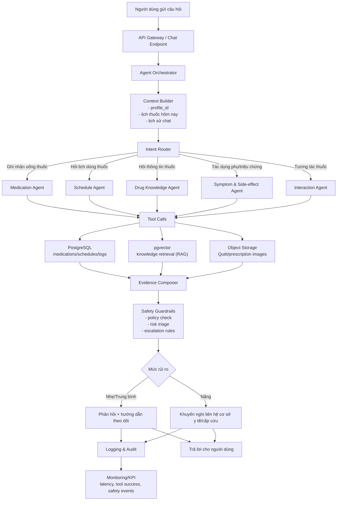

# Sơ đồ Agentic MedIntel

## Luồng ngắn gọn

1. Nhận tin nhắn -> dựng ngữ cảnh bệnh nhân.
2. Phân loại ý định -> chọn tác tử chuyên trách.
3. Tác tử gọi công cụ lấy dữ liệu cấu trúc + tri thức thuốc (RAG).
4. Ghép bằng chứng -> chạy lớp an toàn.
5. Trả lời theo mức rủi ro và ghi log theo dõi.

