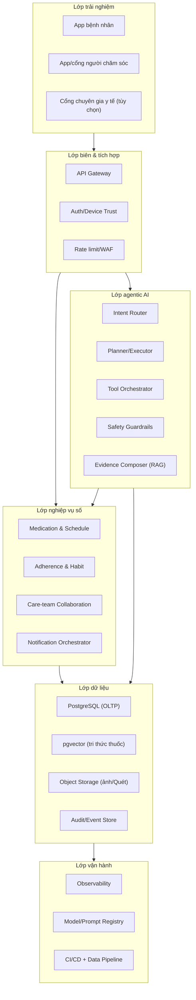
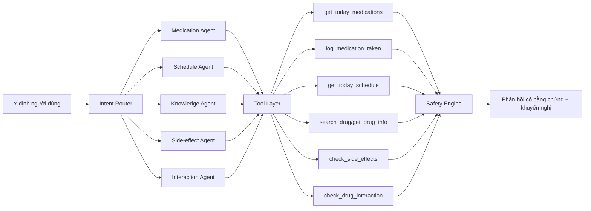
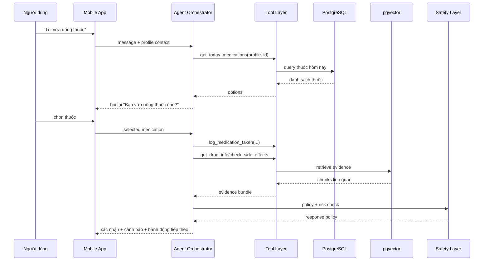
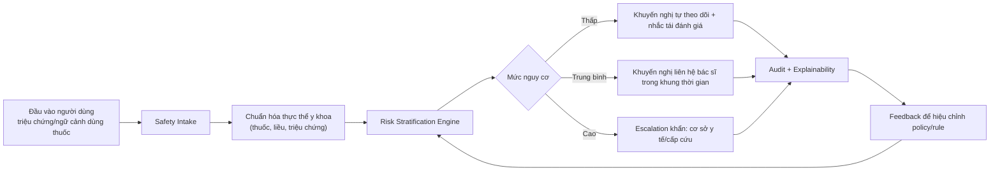
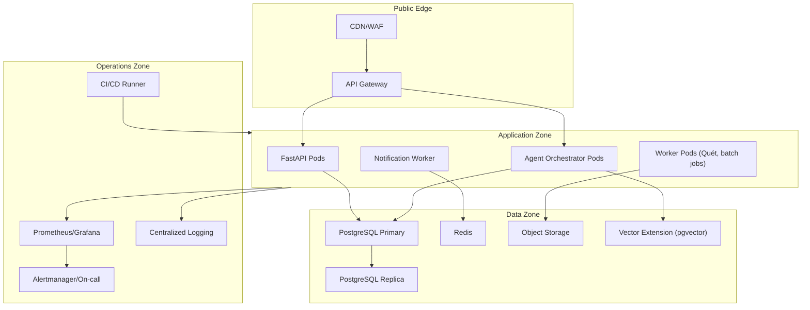
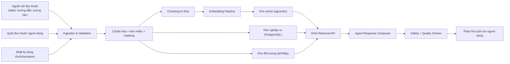
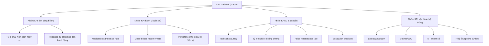
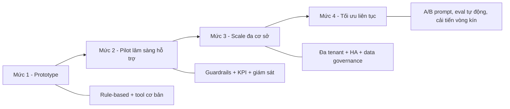

# MedIntel - Sơ đồ kiến trúc vĩ mô (Macro)

## 1) Kiến trúc vĩ mô đa lớp

## 2) Sơ đồ ý định -> tác tử -> công cụ

## 3) Luồng macro cho ca "Tôi vừa uống thuốc"

## 4) Vòng an toàn y tế (Clinical Safety Loop)

## 5) Kiến trúc triển khai (Deployment Topology)

## 6) Data Lineage cho nhánh AI y tế

## 7) Bảng điều khiển KPI chiến lược

## 8) Lộ trình trưởng thành hệ thống (Maturity Roadmap)

