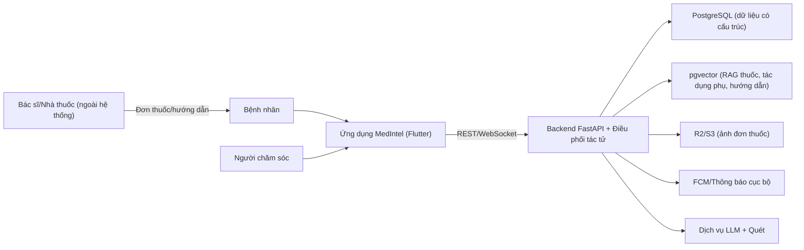
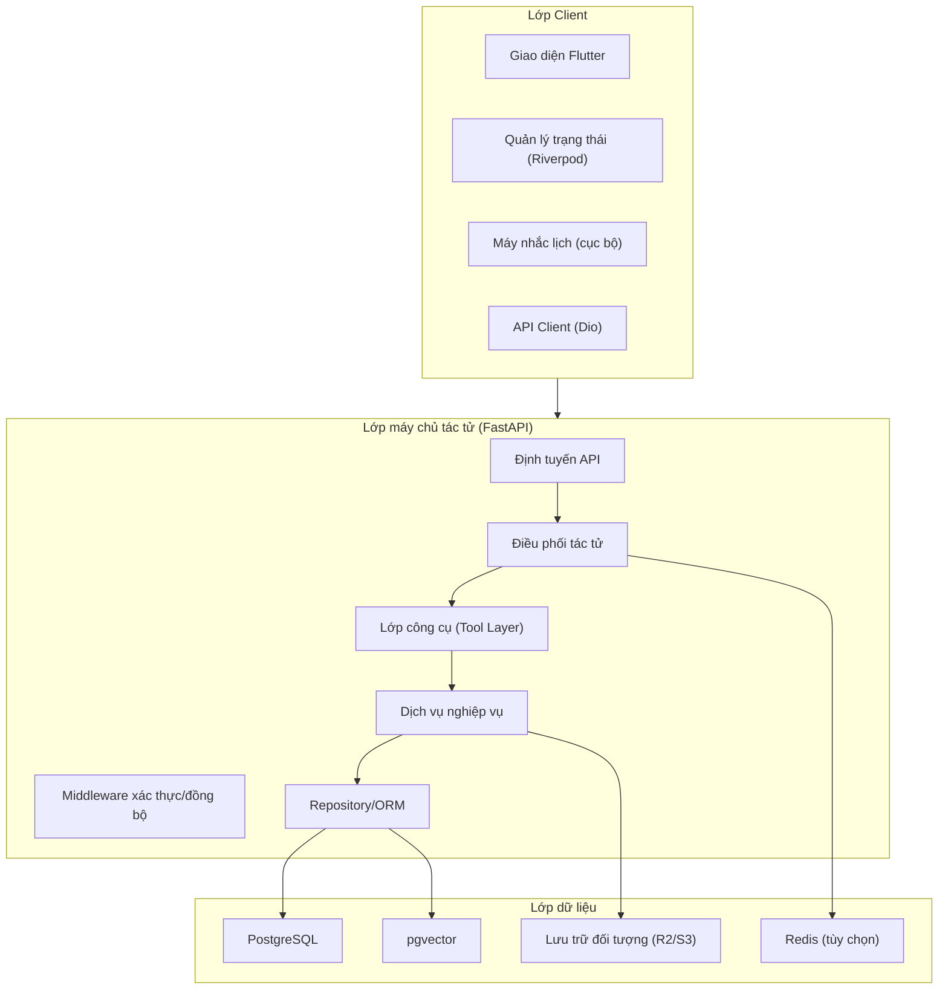
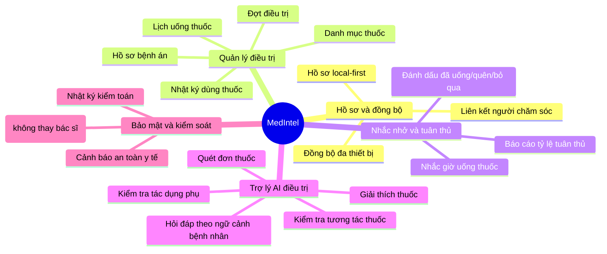
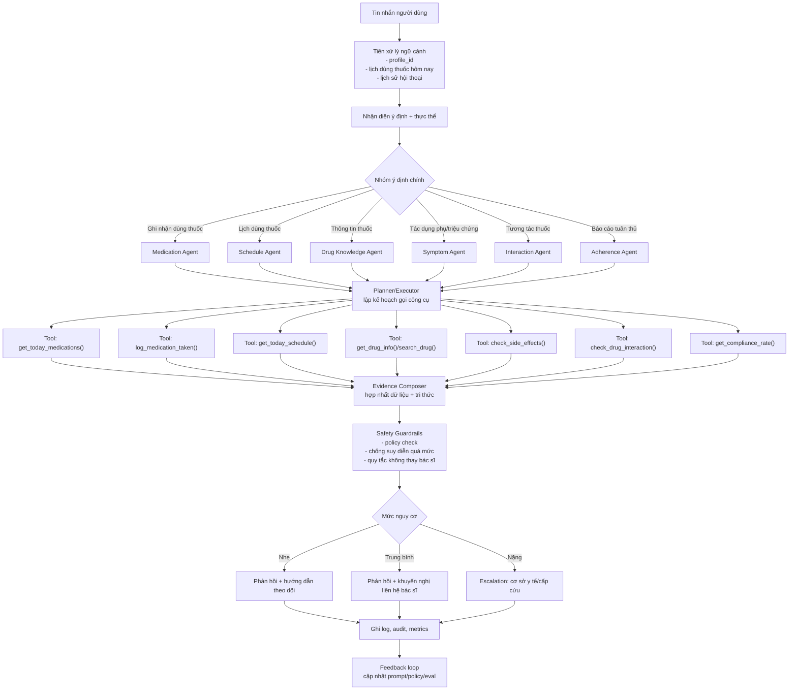
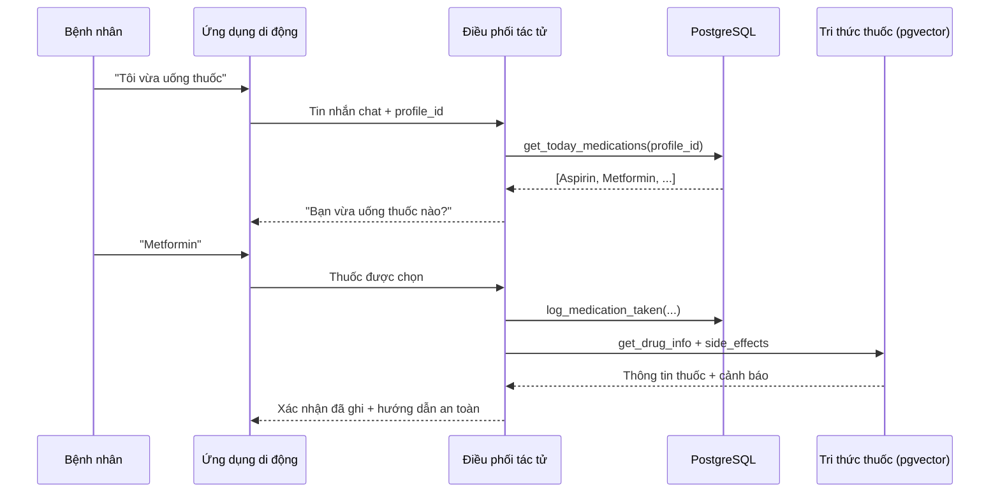
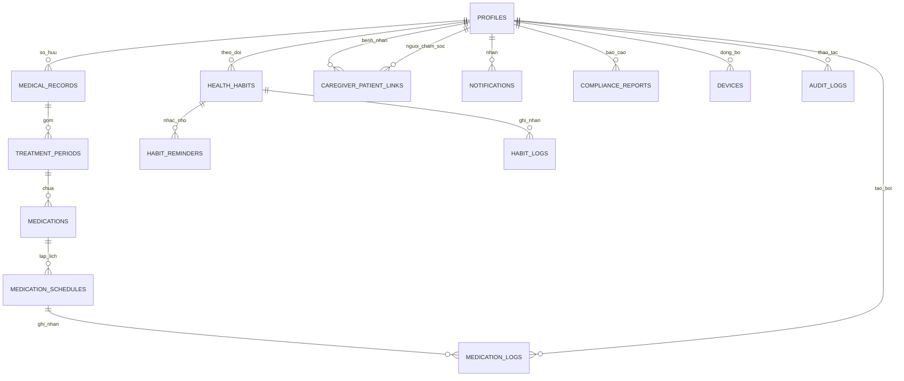
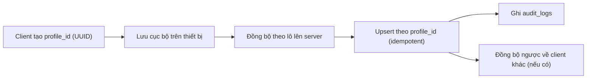

# MedIntel - Sơ đồ mô hình hóa kiến trúc và chức năng

Tài liệu này tổng hợp sơ đồ từ `doc.md`, `architecture.md`, `db-design.md`, `agentic-medical.md`.

## 1) Sơ đồ bối cảnh (hệ thống tổng thể)

## 2) Sơ đồ container (kiến trúc 3 lớp)

## 3) Bản đồ chức năng nghiệp vụ (Functional Map)

## 4) Luồng agentic mở rộng (đa tầng điều phối)

## 5) Sequence - Trường hợp "Tôi vừa uống thuốc"

## 6) Tổng quan mô hình dữ liệu (rút gọn từ `db-design.md`)

## 7) Luồng bảo mật và quản trị (đồng bộ local-first)

## 8) Gợi ý sử dụng trong báo cáo

- Chương kiến trúc tổng thể: dùng sơ đồ 1 + 2.
- Chương đặc tả chức năng: dùng sơ đồ 3.
- Chương AI/agentic: dùng sơ đồ 4 + 5.
- Chương CSDL: dùng sơ đồ 6.
- Chương đồng bộ và bảo mật: dùng sơ đồ 7.

