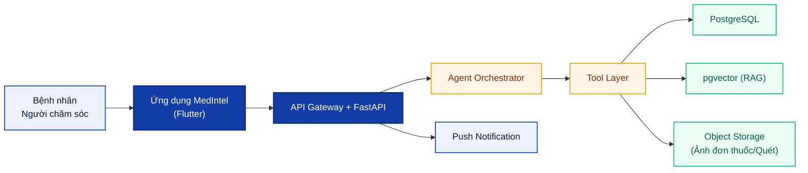
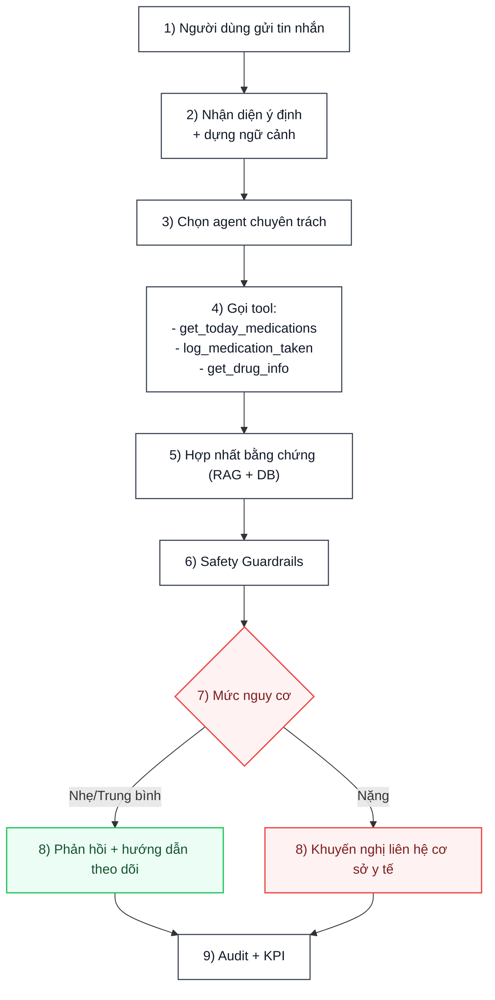
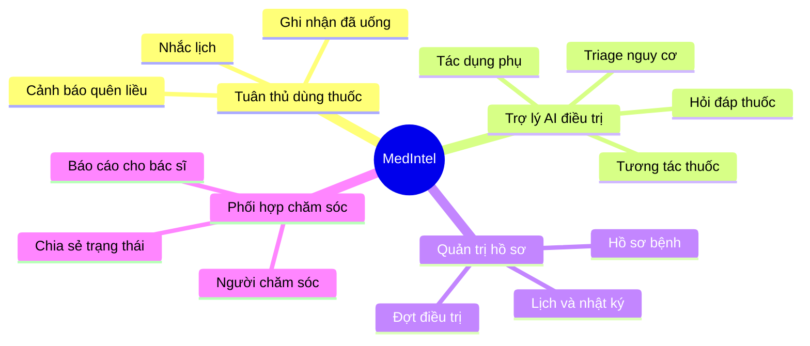
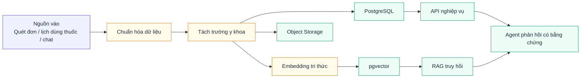
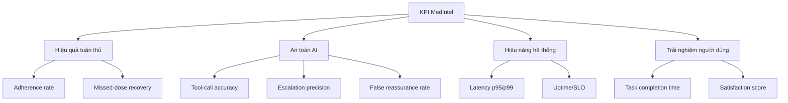
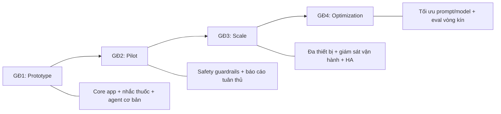

# MedIntel - Bộ sơ đồ poster NCKH

> Mục tiêu: dùng trực tiếp cho poster/báo cáo tóm tắt, ưu tiên trực quan, ít chữ, khối lớn.

---

## Hình P1. Kiến trúc tổng thể hệ thống MedIntel

**Thông điệp chính:** Kiến trúc 3 lớp, AI agent là lõi điều phối giữa nghiệp vụ và tri thức thuốc.

---

## Hình P2. Luồng agentic "Tôi vừa uống thuốc"

**Thông điệp chính:** Mọi phản hồi đều qua lớp an toàn trước khi trả cho người bệnh.

---

## Hình P3. Bản đồ chức năng nghiên cứu

**Thông điệp chính:** Hệ thống tích hợp cả quản lý điều trị, AI hỗ trợ và phối hợp chăm sóc.

---

## Hình P4. Kiến trúc dữ liệu và tri thức

**Thông điệp chính:** Dữ liệu cấu trúc + dữ liệu ngữ nghĩa cùng phục vụ quyết định của agent.

---

## Hình P5. Khung đánh giá kết quả (KPI)

**Thông điệp chính:** Đánh giá đồng thời 4 trục: lâm sàng hỗ trợ, AI an toàn, vận hành, trải nghiệm.

---

## Hình P6. Lộ trình phát triển theo giai đoạn

**Thông điệp chính:** Nghiên cứu có lộ trình tiến hóa rõ từ nguyên mẫu đến hệ thống vận hành quy mô.

---

## Gợi ý dàn poster

- Cột trái: **P1 + P3**
- Cột giữa: **P2 + P4**
- Cột phải: **P5 + P6**
- Dưới mỗi hình giữ 1 câu “Thông điệp chính” như trên để hội đồng đọc nhanh.

